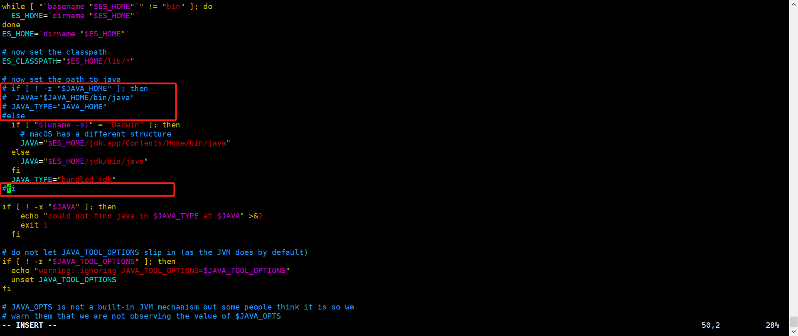
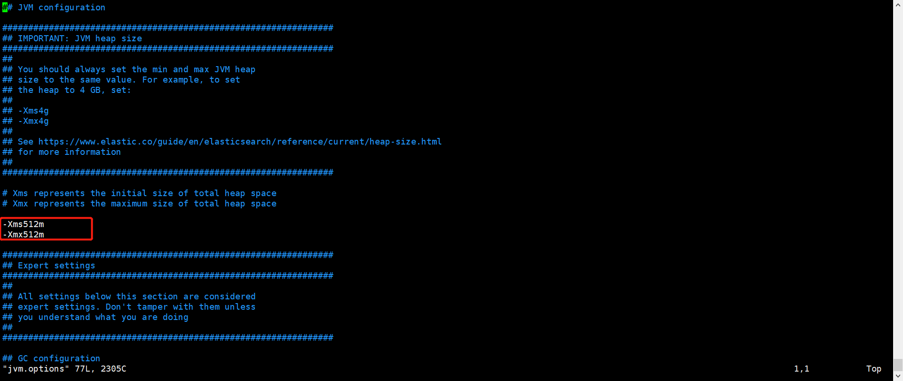
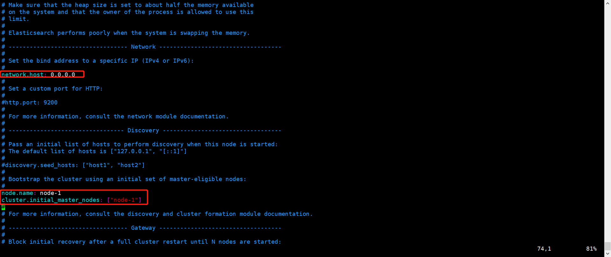
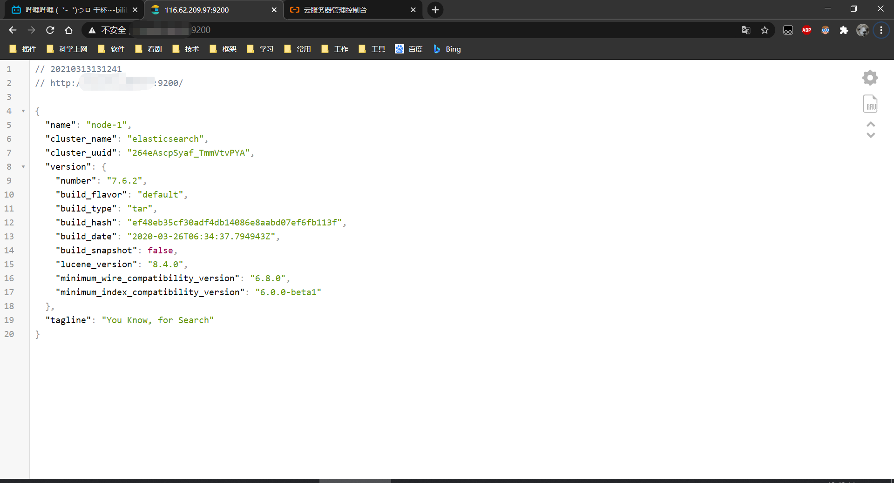
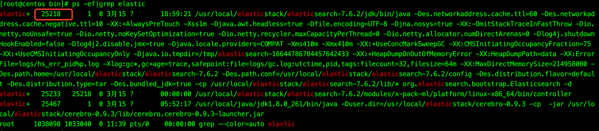
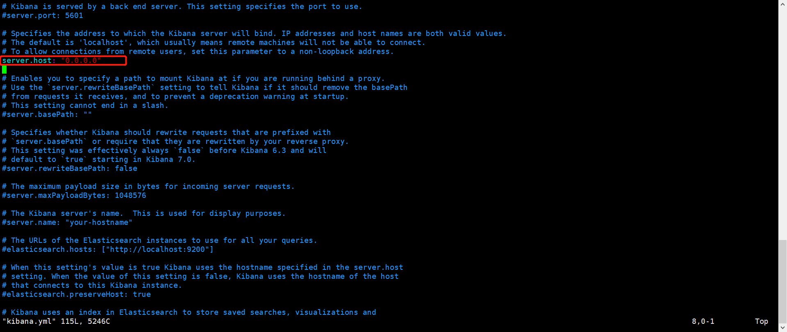
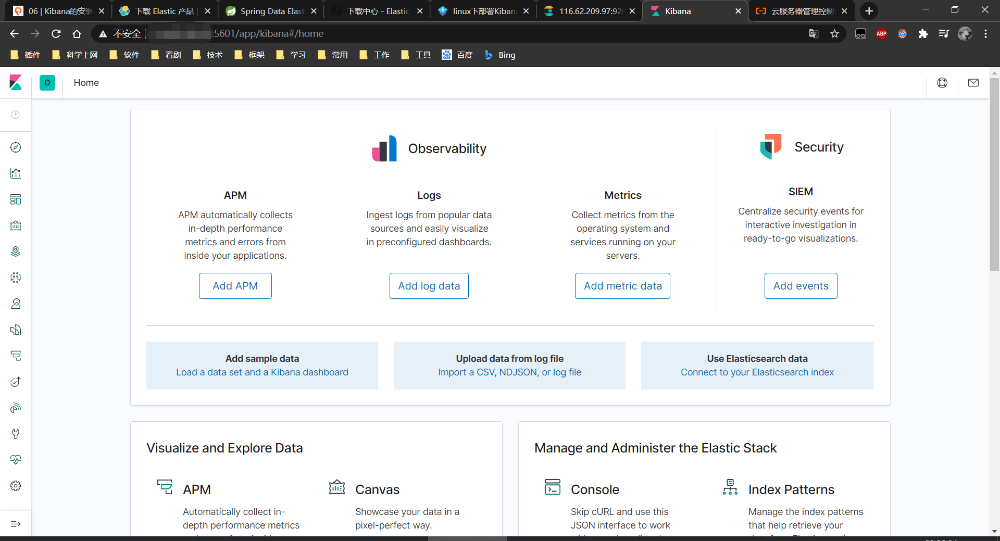
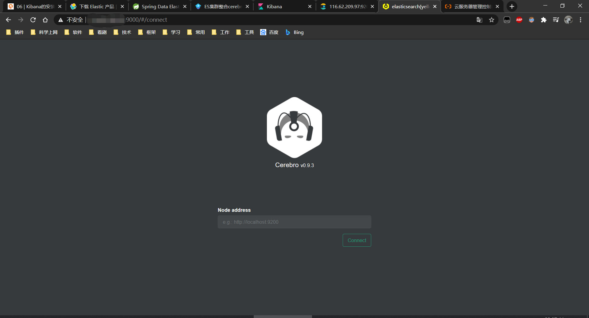

# Elasticsearch 安装文档

# 1 安装`Elasticsearch`

## 1.1 云服务器开启`9200`、`9300`端口

## 1.2 下载`Elasticsearch`压缩包上传至`/usr/local/elasticstack`

## 1.3 解压：`tar -zxvf`

## 1.4 `Elasticsearch`不能`root`用户启动，所以新建一个用户

- 1.4.1 新建名为`elasticsearch`的用户：`adduser elasticsearch`

- 1.4.2 设置密码：`passwd elasticsearch`

- 1.4.3 将`elasticsearch`的整个目录都归属到新用户下：chown -R elasticsearch:elasticsearch
  /usr/local/elasticstack/elasticsearch-7.6.2/

- 1.4.4 切换到`elasticsearch`用户：su elasticsearch

## 1.5 设置使用Elasticsearch自带的`JDK`启动

- 1.5.1 `vim /usr/local/elasticstack/elasticsearch-7.6.2/bin/elasticsearch-env`
  

## 1.6 配置`Elasticsearch`启动时`JVM`占用内存大小

- `vim /usr/local/elasticstack/elasticsearch-7.6.2/config/jvm.options`
  

## 1.7 配置节点名和让外网机器可以访问`Elasticsearch`

- 1.7.1 `vim /usr/local/elasticstack/elasticsearch-7.6.2/config/elasticsearch.yml`
  

## 1.8 启动`Elasticsearch`

- 1.8.1 切换到相应目录：`cd /usr/local/elasticsearch/elasticsearch-7.6.2/bin`

- 1.8.2 前台启动：`./elasticsearch`

- 1.8.3 后台启动：`./elasticsearch -d`

## 1.8 验证启动情况：浏览器输入 IP:9200



## 1.9 停止`Elasticsearch`

- 1.9.1 `ps -ef | grep elastic`  
  

- 1.9.2 `kill -9 25218`

# 2 安装`analysis-icu`插件

## 2.1 下载`analysis-icu-7.6.2.zip`上传至`/usr/local/elasticsearch`

## 2.2 解压到`plugin`目录下：`unzip analysis-icu-7.6.2.zip -d /usr/local/elasticsearch/elasticsearch-7.6.2/plugins/analysis-icu-7.6.2`

## 2.3 查看插件列表： `/usr/local/elasticstack/elasticsearch-7.6.2/bin/elasticsearch-plugin list`

# 3 安装`Kibana`

## 3.1 云服务器开启`5601`端口

## 3.2 下载`Kibana`压缩包上传至`/usr/local/elasticsearch/software`

## 3.3 解压：`tar -zxvf kibana-7.6.2-linux-x86_64.tar.gz --strip-components=1 -C ../kibana-7.6.2/`

- 3.3.1 `--strip-components=1`参数是直接将文件解压到`kibana-7.6.2`，不要再生成外部目录

## 3.4 将`Kibana`的整个目录都归属到新用户下：chown -R elasticsearch:elasticsearch /usr/local/elasticstack/kibana-7.6.2/

## 3.5 配置外网机器可以访问`Kibana`

`vim /usr/local/elasticstack/kibana-7.6.2/config/kibana.yml`


## 3.6 启动`Kibana`

- 3.6.1 切换到相应目录：`cd /usr/local/elasticsearch/kibana-7.6.2/bin`

- 3.6.2 前台启动：`./kibana`

- 3.6.3 后台启动：`nohup ./kibana > /usr/local/elasticstack/kibana-7.6.2/logs/kibana.log 2>&1 &`

## 3.7 验证启动情况：浏览器输入 IP:5601



# 4 安装`Cerebro`（监控`Elasticseach`集群）

## 4.1 云服务器开启`9000`端口

## 4.2 下载`Cerebro`压缩包上传至`/usr/local/elasticstack/software`

## 4.3 解压：`tar -zxvf cerebro-0.9.3.tgz --strip-components=1 -C ../cerebro-0.9.3/`

- 4.3.1 `--strip-components=1`参数是直接将文件解压到`cerebro-0.9.3`，不要再生成外部目录

## 4.4 将`Cerebro`的整个目录都归属到新用户下：chown -R elasticsearch:elasticsearch /usr/local/elasticstack/cerebro-0.9.3/

## 4.5 启动`Cerebro`

- 4.5.1 切换到相应目录：`cd /usr/local/elasticstack/cerebro-0.9.3/bin`

- 4.5.2 后台启动：`nohup ./cerebro > /usr/local/elasticstack/cerebro-0.9.3/logs/cerebro.log 2>&1 &`

## 4.6 验证启动情况：浏览器输入 IP:9000



# 5 Docker-compose 方式安装 Elasticsearch 和 Kibana

## 5.1 docker-compose.yml

```yaml
version: '3.3'
services:
  elasticsearch:
    image: docker.elastic.co/elasticsearch/elasticsearch:7.14.2
    container_name: elasticsearch
    ports:
      - 9200:9200
      - 9300:9300
    environment:
      - discovery.type=single-node
      - cluster.name=docker-cluster
      - bootstrap.memory_lock=true
      - "ES_JAVA_OPTS=-Xms512m -Xmx512m"
    ulimits:
      memlock:
        soft: -1
        hard: -1
    networks:
      - elastic

  kibana:
    image: docker.elastic.co/kibana/kibana:7.14.2
    container_name: kibana
    ports:
      - 5601:5601
    environment:
      - ELASTICSEARCH_HOSTS=http://elasticsearch:9200
    networks:
      - elastic

networks:
  elastic:
    driver: bridge
```

## 5.2 启动

```shell
docker-compose up
```
