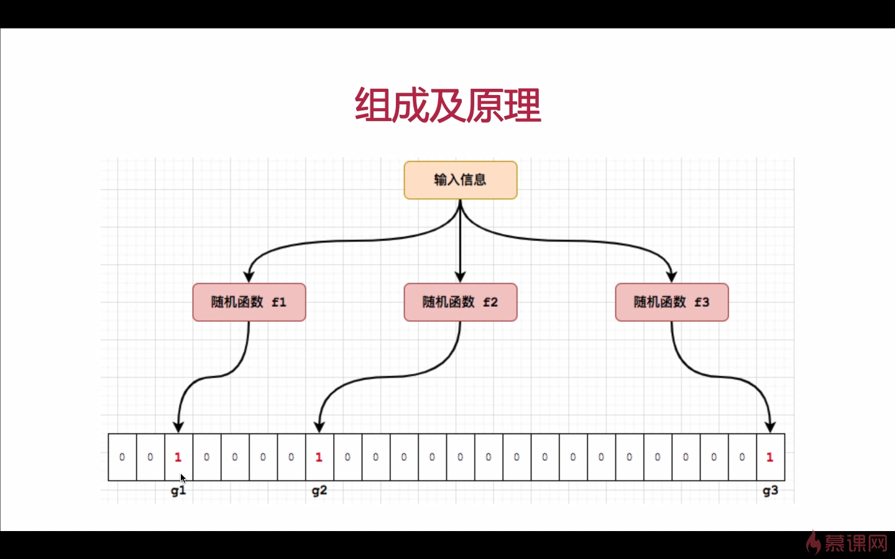
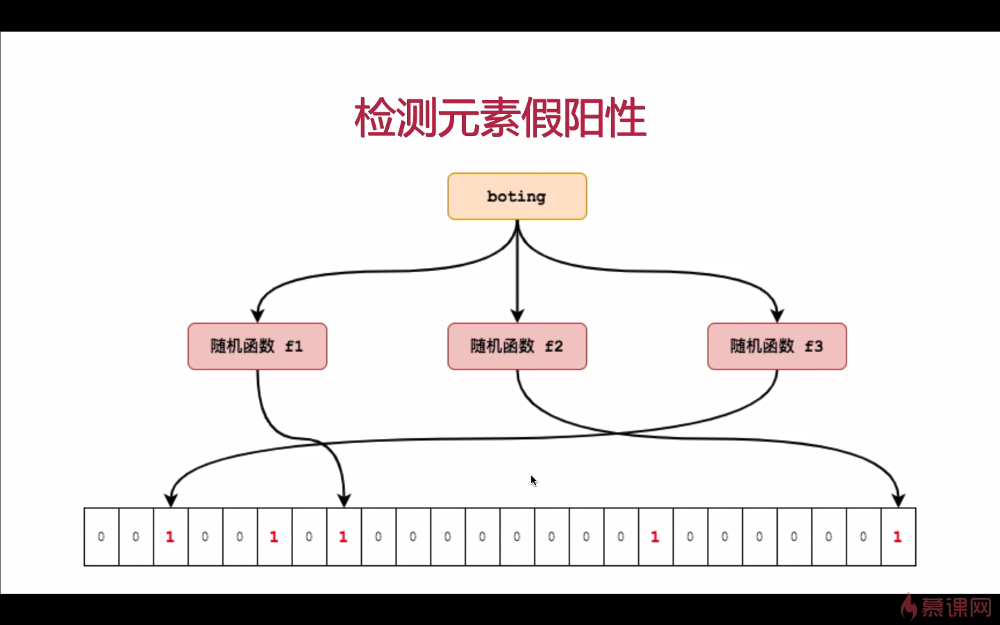

# 演示guava工具集使用案例

> 本项目主要演示guava工具集使用方式

## 1 布隆过滤器

### 1.1 [`BloomFilterTest.java`](./src/main/java/com/demo/guava/bloomfilter/BloomFilterTest.java)

### 1.2 原理

  

### 1.3 优点

1.2.1 不需要存储数据本身，节省资源，保证信息安全  
1.2.2 插入和查找时间复杂度均是O(k)，k是随机函数个数  
1.2.3 Hash函数之间相互独立，可以在硬件层间并行计算

### 1.4 应用场景

1.3.1 检测单纯拼写是否正确  
1.3.2 检测一个网站是否被访问过  
1.3.3 垃圾邮件过滤

## 2 不可变集合

### 2.1 ImmutableSet [`ImmutableTest.java`](./src/main/java/com/demo/guava/immutablecollection/ImmutableTest.java)

## 3 新型集合

### 3.1 HashMultiset [`MultisetTest.java`](./src/main/java/com/demo/guava/multiset/MultisetTest.java)

## 4 集合工具类

### 4.1 Sets [`SetsTest.java`](src/main/java/com/demo/guava/collectionutil/SetsTest.java)

### 4.2 Lists [`ListsTest.java`](src/main/java/com/demo/guava/collectionutil/ListsTest.java)

### 4.3 Maps [`MapsTest.java`](src/main/java/com/demo/guava/collectionutil/MapsTest.java)