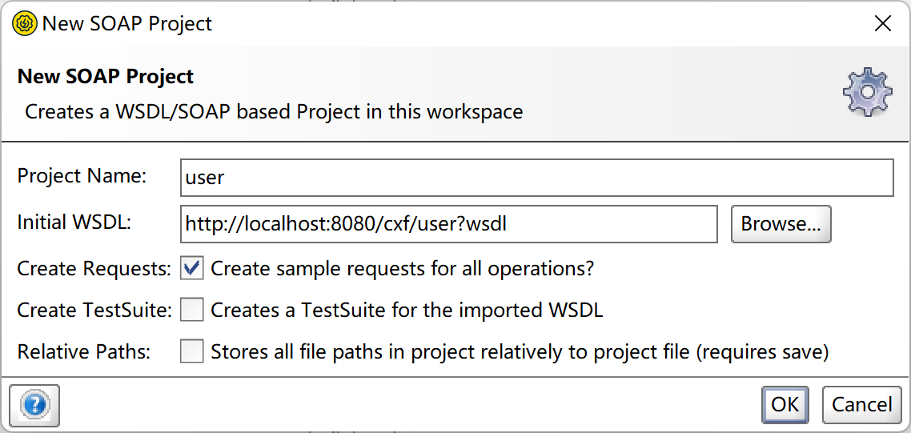
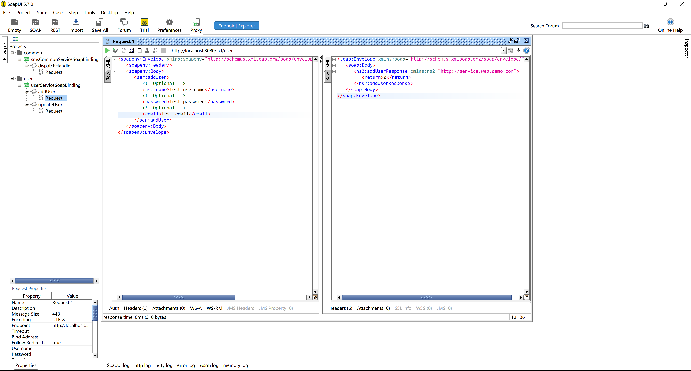

# Spring Boot 集成 Web Service 案例

# 1 基础框架搭建

## 1.1 主要依赖

```xml

<dependencies>
    <dependency>
        <groupId>org.springframework.boot</groupId>
        <artifactId>spring-boot-starter-web</artifactId>
    </dependency>

    <dependency>
        <groupId>org.springframework.boot</groupId>
        <artifactId>spring-boot-starter-web-services</artifactId>
    </dependency>

    <dependency>
        <groupId>org.projectlombok</groupId>
        <artifactId>lombok</artifactId>
        <optional>true</optional>
    </dependency>

    <dependency>
        <groupId>org.springframework.boot</groupId>
        <artifactId>spring-boot-starter-test</artifactId>
        <scope>test</scope>
    </dependency>

    <dependency>
        <groupId>org.apache.cxf</groupId>
        <artifactId>cxf-spring-boot-starter-jaxws</artifactId>
        <version>3.5.2</version>
    </dependency>
</dependencies>
```

## 1.2 建立对应的传输实体类

[`UserDTO.java`](./src/main/java/com/demo/web/domain/UserDTO.java)

## 1.3 建立对应的配置类

[`CxfConfig.java`](./src/main/java/com/demo/web/config/CxfConfig.java)

## 1.4 服务层

[`UserService.java`](./src/main/java/com/demo/web/service/UserService.java)

## 1.5 服务层实现类

[`UserServiceImpl.java`](./src/main/java/com/demo/web/service/impl/UserServiceImpl.java)

## 1.6 控制层

[`UserController.java`](./src/main/java/com/demo/web/controller/UserController.java)

## 1.7 配置文件

[`application.yml`](./src/main/resources/application.yml)

# 2 请求示例

## 2.1 访问对应的WSDL

- 访问路径：http://localhost:8080/cxf/user?wsdl

利用SoapUI访问：  



## 2.2 访问对应的接口

- 新增用户：http://localhost:8080/test-user POST
- 更新用户：http://localhost:8080/test-user PATCH